# Open Lakehouse Platform — Master Architecture Plan

> **Status:** Living document — updated as implementation progresses.
> **Date:** 2026-03-12
> **Author:** Principal Data Platform Architect

---

## Table of Contents

1. [Full Directory Tree](#1-full-directory-tree)
2. [Architecture Diagram](#2-architecture-diagram)
3. [Network Topology](#3-network-topology)
4. [Security Perimeter](#4-security-perimeter)
5. [Implementation Sequence](#5-implementation-sequence)
6. [Version Compatibility Matrix](#6-version-compatibility-matrix)
7. [HA Topology](#7-ha-topology)
8. [Secret Graph](#8-secret-graph)
9. [Data Flow](#9-data-flow)
10. [Auth Flow](#10-auth-flow)
11. [Observability Plan](#11-observability-plan)
12. [Testing Strategy](#12-testing-strategy)
13. [Rollout Strategy](#13-rollout-strategy)

---

## 1. Full Directory Tree

```
open-lakehouse-platform/
│
├── README.md                          # Project entry point, component table, quick start
├── PLAN.md                            # This file — master architecture plan
│
├── docs/
│   ├── adr/                           # Architecture Decision Records (MADR format)
│   │   ├── ADR-001-polaris-vs-atlas.md
│   │   ├── ADR-002-openbao-vs-vault.md
│   │   ├── ADR-003-docling-vs-unstructured.md
│   │   ├── ADR-004-great-expectations.md
│   │   ├── ADR-005-dual-catalog-strategy.md
│   │   ├── ADR-006-mtls-strategy.md
│   │   ├── ADR-007-identity-federation-keycloak.md
│   │   ├── ADR-008-ha-strategy.md
│   │   ├── ADR-009-audit-trail-design.md
│   │   └── ADR-010-multi-tenancy-model.md
│   │
│   ├── architecture/
│   │   ├── overview.md                # High-level component map and responsibilities
│   │   ├── data-flow.md               # End-to-end document ingestion and query path
│   │   ├── security-model.md          # mTLS, OIDC, RBAC, secret injection chain
│   │   └── ha-topology.md             # Per-component HA design with failover behavior
│   │
│   └── compliance/
│       ├── gdpr-data-map.md           # Data controller/processor map, retention, erasure
│       ├── soc2-control-mapping.md    # SOC2 Trust Criteria → platform control mapping
│       └── audit-trail-specification.md  # Immutable audit log schema, storage, access
│
├── infra/
│   ├── local/                         # Docker Compose environment for local development
│   │   ├── docker-compose.yml         # Full stack single-node compose
│   │   ├── docker-compose.override.yml # Dev-mode overrides (hot reload, debug ports)
│   │   └── .env.example               # Template env file (no real secrets)
│   │
│   ├── k8s/                           # Kubernetes manifests and Helm values
│   │   ├── base/                      # Kustomize base — shared across all environments
│   │   │   ├── namespaces.yaml        # All K8s namespaces
│   │   │   ├── network-policies.yaml  # Default-deny + allow-listed ingress/egress
│   │   │   └── resource-quotas.yaml   # Per-namespace CPU/memory quotas
│   │   │
│   │   ├── staging/                   # Staging-specific Kustomize overlays
│   │   │   └── kustomization.yaml
│   │   │
│   │   └── prod/                      # Production-specific Kustomize overlays
│   │       └── kustomization.yaml
│   │
│   ├── helm/                          # Helm chart values (one file per component)
│   │   ├── polaris/
│   │   ├── nessie/
│   │   ├── trino/
│   │   ├── trino-gateway/
│   │   ├── ranger/
│   │   ├── openmetadata/
│   │   ├── openbao/
│   │   ├── external-secrets/
│   │   ├── cert-manager/
│   │   ├── keycloak/
│   │   ├── airflow/
│   │   ├── minio/
│   │   ├── prometheus-stack/
│   │   ├── otel-collector/
│   │   └── loki-stack/
│   │
│   └── terraform/                     # Infrastructure as Code for cloud resources
│       ├── modules/
│       │   ├── networking/            # VPC, subnets, security groups
│       │   ├── k8s-cluster/           # Managed K8s cluster (EKS/GKE/AKS)
│       │   ├── object-storage/        # S3-compatible bucket provisioning
│       │   ├── dns/                   # External DNS + TLS certificate automation
│       │   └── iam/                   # Cloud IAM roles for workload identity
│       ├── staging/
│       └── prod/
│
├── services/
│   ├── docling-worker/                # Stateless document ingestion workers
│   │   ├── Dockerfile
│   │   ├── src/
│   │   └── tests/
│   │
│   ├── quality-gate/                  # Great Expectations checkpoint runner
│   │   ├── Dockerfile
│   │   ├── gx/                        # GX context, datasources, expectations suites
│   │   └── tests/
│   │
│   ├── metadata-sync/                 # OpenMetadata connector configurations
│   │   └── connectors/
│   │
│   └── dbt-project/                   # dbt project targeting Trino
│       ├── dbt_project.yml
│       ├── profiles/
│       ├── models/
│       │   ├── staging/               # Raw → cleaned layer
│       │   ├── intermediate/          # Business logic
│       │   └── marts/                 # Analytics-ready tables
│       ├── macros/
│       └── tests/
│
├── pipelines/
│   ├── airflow/
│   │   ├── dags/                      # Airflow DAG definitions
│   │   │   ├── ingestion/             # Document & raw data ingestion DAGs
│   │   │   ├── transformation/        # dbt run + test DAGs
│   │   │   ├── quality/               # Great Expectations checkpoint DAGs
│   │   │   └── maintenance/           # Iceberg compaction, snapshot expiry DAGs
│   │   └── plugins/                   # Custom Airflow operators/sensors
│   │
│   └── scripts/                       # Utility scripts (bootstrap, migration)
│       ├── bootstrap-polaris.sh
│       ├── bootstrap-ranger.sh
│       └── rotate-secrets.sh
│
├── security/
│   ├── openbao/
│   │   ├── policies/                  # OpenBao ACL policies per service
│   │   └── pki/                       # CA chain + intermediate CA config
│   │
│   ├── cert-manager/
│   │   ├── cluster-issuer.yaml        # Let's Encrypt + internal CA issuers
│   │   └── certificates/              # Per-service certificate resources
│   │
│   ├── ranger/
│   │   ├── policies/                  # Ranger policy export (JSON)
│   │   └── service-defs/              # Custom Ranger service definitions
│   │
│   └── keycloak/
│       ├── realm-export.json          # Keycloak realm configuration (no secrets)
│       └── clients/                   # Per-client OIDC config templates
│
├── observability/
│   ├── prometheus/
│   │   ├── rules/                     # Alert rules per component
│   │   └── scrape-configs/            # Additional scrape configs
│   ├── grafana/
│   │   ├── dashboards/                # Dashboard JSON per component
│   │   └── datasources/               # Datasource provisioning
│   ├── loki/
│   │   └── pipelines/                 # Promtail / Loki pipeline configs
│   └── otel/
│       └── collector-config.yaml      # OTEL collector pipeline config
│
└── tests/
    ├── unit/                          # Fast, no-infrastructure tests
    ├── integration/                   # Tests requiring live services
    ├── e2e/                           # Full-stack scenario tests
    └── performance/                   # Load tests (k6 / locust)
```

---

## 2. Architecture Diagram

```mermaid
%%{init: {"theme": "base", "themeVariables": {"fontSize": "14px"}}}%%
graph TB
    subgraph EXTERNAL["External Clients"]
        USER["👤 Human User / BI Tool"]
        API_CLIENT["🤖 API Client / App"]
    end

    subgraph INGRESS["Ingress Layer (TLS Termination)"]
        NGINX["Nginx / Traefik\nIngress Controller"]
    end

    subgraph IDENTITY["Identity & Access (keycloak-ns)"]
        KC["Keycloak\nOIDC Provider\n(latest stable)"]
    end

    subgraph SECRETS["Secret Management (secrets-ns)"]
        OPENBAO["OpenBao\n(latest stable)"]
        ESO["External Secrets\nOperator\n(latest stable)"]
        CERTMGR["cert-manager\n(latest stable)"]
    end

    subgraph CATALOG["Catalog Layer (catalog-ns)"]
        POLARIS["Apache Polaris 1.2.0\nProd Catalog\n(REST + Iceberg)"]
        NESSIE["Project Nessie\nDev/Branching Catalog\n(Git-like semantics)"]
    end

    subgraph STORAGE["Object Storage (storage-ns)"]
        MINIO["MinIO\n(latest stable)\nDistributed Mode\n4+ nodes"]
    end

    subgraph COMPUTE["Query Engine (compute-ns)"]
        TRINO_GW["Trino Gateway\n(latest stable)\nLoad Balancer"]
        TRINO1["Trino 479\nCluster-A"]
        TRINO2["Trino 479\nCluster-B"]
    end

    subgraph POLICY["Policy & Security (policy-ns)"]
        RANGER["Apache Ranger 2.6.0\nPolicy Engine"]
    end

    subgraph INGESTION["Ingestion Layer (ingestion-ns)"]
        AIRFLOW["Apache Airflow 2.10.x\nOrchestrator"]
        DOCLING["Docling (IBM)\nDocument Parser\n(latest stable)"]
        GX["Great Expectations\nQuality Gate\n(latest stable)"]
    end

    subgraph TRANSFORM["Transformation (transform-ns)"]
        DBT["dbt-core + dbt-trino\n(latest stable)"]
    end

    subgraph METADATA["Metadata & Lineage (metadata-ns)"]
        OPENMD["OpenMetadata 1.12.x\nData Catalog & Lineage"]
    end

    subgraph OBSERVABILITY["Observability (observability-ns)"]
        PROM["Prometheus +\nAlertmanager\n(latest stable)"]
        GRAFANA["Grafana\n(latest stable)"]
        LOKI["Grafana Loki\n(latest stable)"]
        OTEL["OpenTelemetry\nCollector\n(latest stable)"]
    end

    subgraph DB["State Stores (db-ns)"]
        PG_KC["PostgreSQL 16\nKeycloak DB"]
        PG_MD["PostgreSQL 16\nOpenMetadata DB"]
        PG_AF["PostgreSQL 16\nAirflow DB"]
        PG_RG["PostgreSQL 16\nRanger DB"]
        PG_PL["PostgreSQL 16\nPolaris DB"]
    end

    %% External access
    USER -->|"HTTPS/443\nOIDC Login"| NGINX
    API_CLIENT -->|"HTTPS/443"| NGINX
    NGINX -->|"mTLS"| TRINO_GW
    NGINX -->|"mTLS"| OPENMD
    NGINX -->|"OIDC"| KC

    %% Auth flow
    KC -->|"JWT token\nvalidation"| TRINO_GW
    KC -->|"OIDC federation"| RANGER
    KC -->|"OIDC federation"| OPENMD
    KC -->|"OIDC federation"| AIRFLOW
    KC -->|"OIDC federation"| GRAFANA

    %% Secret injection
    OPENBAO -->|"dynamic secrets"| ESO
    ESO -->|"K8s Secrets"| POLARIS
    ESO -->|"K8s Secrets"| TRINO1
    ESO -->|"K8s Secrets"| TRINO2
    ESO -->|"K8s Secrets"| MINIO
    ESO -->|"K8s Secrets"| AIRFLOW
    ESO -->|"K8s Secrets"| RANGER
    CERTMGR -->|"mTLS certs\nfrom OpenBao PKI"| POLARIS
    CERTMGR -->|"mTLS certs"| TRINO1
    CERTMGR -->|"mTLS certs"| TRINO2
    CERTMGR -->|"mTLS certs"| MINIO
    CERTMGR -->|"mTLS certs"| RANGER
    CERTMGR -->|"mTLS certs"| NESSIE

    %% Query path
    TRINO_GW -->|"mTLS\nroutes"| TRINO1
    TRINO_GW -->|"mTLS\nroutes"| TRINO2
    TRINO1 -->|"AuthZ check"| RANGER
    TRINO2 -->|"AuthZ check"| RANGER
    TRINO1 -->|"Iceberg REST"| POLARIS
    TRINO2 -->|"Iceberg REST"| POLARIS
    TRINO1 -->|"Iceberg REST (dev)"| NESSIE
    POLARIS -->|"S3 API (mTLS)"| MINIO
    NESSIE -->|"S3 API (mTLS)"| MINIO

    %% Ingestion path
    AIRFLOW -->|"orchestrates"| DOCLING
    AIRFLOW -->|"orchestrates"| GX
    AIRFLOW -->|"orchestrates"| DBT
    DOCLING -->|"writes parquet"| MINIO
    GX -->|"validates\nIceberg tables"| TRINO1
    DBT -->|"models via\nTrino"| TRINO1

    %% Catalog registration
    AIRFLOW -->|"register tables"| POLARIS
    AIRFLOW -->|"dev branch"| NESSIE

    %% Metadata
    OPENMD -->|"crawls lineage"| TRINO1
    OPENMD -->|"catalog sync"| POLARIS
    OPENMD -->|"table meta"| NESSIE

    %% Observability
    OTEL -->|"traces"| PROM
    OTEL -->|"traces"| LOKI
    PROM -->|"metrics"| GRAFANA
    LOKI -->|"logs"| GRAFANA
    TRINO1 -->|"metrics/traces"| OTEL
    TRINO2 -->|"metrics/traces"| OTEL
    AIRFLOW -->|"metrics"| OTEL
    MINIO -->|"metrics"| PROM

    %% DB connections
    KC --- PG_KC
    OPENMD --- PG_MD
    AIRFLOW --- PG_AF
    RANGER --- PG_RG
    POLARIS --- PG_PL
```



---

## 3. Network Topology

### 3.1 Local — Docker Networks

| Network Name | Purpose | Attached Services |
|---|---|---|
| `lakehouse-frontend` | External-facing; only ingress container here | Nginx/Traefik |
| `lakehouse-identity` | Identity plane; isolated from compute | Keycloak, PG-KC |
| `lakehouse-secrets` | Secret distribution plane | OpenBao, ESO |
| `lakehouse-catalog` | Catalog REST traffic | Polaris, Nessie, PG-PL |
| `lakehouse-storage` | S3-protocol traffic | MinIO nodes |
| `lakehouse-compute` | Query execution plane | Trino Gateway, Trino A, Trino B |
| `lakehouse-policy` | Policy evaluation plane | Ranger, PG-RG |
| `lakehouse-ingestion` | Batch ingestion workers | Airflow, Docling, GX, dbt |
| `lakehouse-metadata` | Metadata crawling plane | OpenMetadata, PG-MD |
| `lakehouse-observability` | Telemetry collection | Prometheus, Grafana, Loki, OTEL |
| `lakehouse-db` | Database internal traffic | All PostgreSQL instances |

**Network isolation rules (Docker):**
- Services only join networks they strictly need.
- Cross-network communication requires an explicit second network attachment.
- No service except Nginx joins `lakehouse-frontend`.

### 3.2 Kubernetes — Namespaces

| Namespace | Purpose | Network Policy | Egress Allowed To |
|---|---|---|---|
| `ingress-ns` | Ingress controllers, TLS termination | `default-deny` + ingress allow-list | `identity-ns`, `compute-ns`, `metadata-ns` |
| `identity-ns` | Keycloak + its PostgreSQL | `default-deny` | `db-ns` |
| `secrets-ns` | OpenBao, ESO, cert-manager | `default-deny` | All namespaces (secret push only) |
| `catalog-ns` | Polaris, Nessie | `default-deny` | `storage-ns`, `db-ns` |
| `storage-ns` | MinIO distributed | `default-deny` | Internal MinIO peers only |
| `compute-ns` | Trino Gateway + Trino clusters | `default-deny` | `catalog-ns`, `storage-ns`, `policy-ns` |
| `policy-ns` | Ranger admin + plugins | `default-deny` | `db-ns`, `identity-ns` |
| `ingestion-ns` | Airflow, Docling workers, GX, dbt | `default-deny` | `compute-ns`, `storage-ns`, `catalog-ns` |
| `metadata-ns` | OpenMetadata + its PostgreSQL | `default-deny` | `compute-ns`, `catalog-ns` |
| `observability-ns` | Prometheus, Grafana, Loki, OTEL | `default-deny` + scrape allow-list | All namespaces (read/scrape only) |
| `db-ns` | All shared PostgreSQL instances | `default-deny` | None (ingress only) |

**Pod-level mTLS:** Enforced via cert-manager CertificateRequest resources; all pod-to-pod traffic uses mutual TLS with certificates issued by the OpenBao PKI intermediate CA.

---

## 4. Security Perimeter

### 4.1 Externally Exposed (Internet-Facing)

| Endpoint | Protocol | Auth Required | Notes |
|---|---|---|---|
| Keycloak `/auth` | HTTPS (443) | N/A — is the IdP | Behind WAF; rate-limited |
| Trino Gateway | HTTPS (443) | Keycloak JWT (Bearer) | BI tools, Jupyter, API clients |
| OpenMetadata UI | HTTPS (443) | Keycloak OIDC | Read-only for analysts |
| Grafana UI | HTTPS (443) | Keycloak OIDC | Ops team only; Ranger policy |
| Airflow UI | HTTPS (443) | Keycloak OIDC | Data engineers only |

### 4.2 Internal-Only (Never exposed outside cluster)

| Component | Access Method | Notes |
|---|---|---|
| OpenBao | Internal K8s Service (8200) | ESO pulls; no human UI access in prod |
| Apache Polaris | Internal K8s Service (8181) | Only Trino + Airflow reach it |
| Project Nessie | Internal K8s Service (19120) | Dev/staging only |
| MinIO | Internal K8s Service (9000) | S3 API via mTLS; Console port (9001) internal only |
| Apache Ranger Admin | Internal K8s Service (6080) | Policy authors via VPN/bastion only |
| All PostgreSQL | Internal K8s Service (5432) | No external exposure at any time |
| Prometheus | Internal K8s Service (9090) | Scraped by Grafana internally |
| Loki | Internal K8s Service (3100) | Queried by Grafana internally |
| OTEL Collector | Internal K8s Service (4317/4318) | Receives traces/metrics from services |

### 4.3 Defense-in-Depth Layers

1. **L1 — Network:** WAF → Ingress TLS → Network Policies (default-deny)
2. **L2 — Transport:** mTLS between all internal services (cert-manager + OpenBao PKI)
3. **L3 — Identity:** Keycloak OIDC JWT for user auth; Service accounts for M2M
4. **L4 — Authorization:** Ranger policies for data access; K8s RBAC for cluster resources
5. **L5 — Secret:** OpenBao dynamic secrets; ESO syncs; no static credentials anywhere
6. **L6 — Audit:** Immutable audit log in dedicated append-only storage (see ADR-009)

---

## 5. Implementation Sequence

### Phase 0 — Foundation (Weeks 1–2)
**Goal:** Secrets and identity operational; everything else depends on this.

| Step | Component | Depends On | Rationale |
|---|---|---|---|
| 0.1 | PostgreSQL 16 cluster (HA) | Nothing | Shared backend for all stateful services |
| 0.2 | OpenBao (3-node Raft) | PostgreSQL (storage backend) | All secrets managed here first |
| 0.3 | cert-manager + OpenBao PKI CA | OpenBao | mTLS certs cannot be issued without CA |
| 0.4 | External Secrets Operator | OpenBao | Syncs secrets into K8s namespaces |
| 0.5 | Keycloak (HA) | PostgreSQL, cert-manager | Identity provider for all UI + API clients |

### Phase 1 — Storage & Catalog (Weeks 3–4)
**Goal:** Iceberg tables can be created and queried.

| Step | Component | Depends On | Rationale |
|---|---|---|---|
| 1.1 | MinIO (distributed, 4-node) | cert-manager (mTLS) | Object storage must exist before catalog |
| 1.2 | Apache Polaris | PostgreSQL, MinIO, ESO | Prod Iceberg catalog; registers warehouses |
| 1.3 | Project Nessie | MinIO, ESO | Dev/branching catalog; isolated from prod |
| 1.4 | Bootstrap Iceberg schemas | Polaris, MinIO | Create namespaces, initial tables |

### Phase 2 — Compute Layer (Weeks 5–6)
**Goal:** Analysts can query Iceberg data.

| Step | Component | Depends On | Rationale |
|---|---|---|---|
| 2.1 | Apache Ranger | PostgreSQL, Keycloak | Policy engine must exist before Trino |
| 2.2 | Trino 479 (Cluster-A) | Polaris, Ranger, cert-manager | Primary query cluster |
| 2.3 | Trino 479 (Cluster-B) | Polaris, Ranger, cert-manager | HA failover cluster |
| 2.4 | Trino Gateway | Trino A & B, Keycloak | Load balancer + JWT auth endpoint |
| 2.5 | Smoke test queries | Trino Gateway | Validate auth + catalog + storage |

### Phase 3 — Ingestion & Quality (Weeks 7–8)
**Goal:** Documents can be ingested, parsed, validated, stored in Iceberg.

| Step | Component | Depends On | Rationale |
|---|---|---|---|
| 3.1 | Apache Airflow (HA) | PostgreSQL, Keycloak | Orchestrator for all pipelines |
| 3.2 | Docling workers | Airflow, MinIO | Document parsing workers |
| 3.3 | Great Expectations | Airflow, Trino | Quality gate before promotion to mart |
| 3.4 | dbt-trino | Airflow, Trino | Transformation models |
| 3.5 | End-to-end ingestion test | All of Phase 3 | Full pipeline smoke test |

### Phase 4 — Metadata & Observability (Weeks 9–10)
**Goal:** Full lineage, searchable catalog, dashboards operational.

| Step | Component | Depends On | Rationale |
|---|---|---|---|
| 4.1 | OpenMetadata | PostgreSQL, Keycloak, Trino | Lineage crawler needs live query engine |
| 4.2 | OTEL Collector | All services emitting traces | Aggregate before sending to backends |
| 4.3 | Prometheus + Alertmanager | OTEL Collector | Metrics store + alerting |
| 4.4 | Grafana Loki + Promtail | Kubernetes nodes | Log aggregation |
| 4.5 | Grafana + Dashboards | Prometheus, Loki | Unified observability UI |
| 4.6 | Alert rules + runbooks | Prometheus | Ops readiness gate |

### Phase 5 — Security Hardening & Compliance (Weeks 11–12)
**Goal:** SOC2 / GDPR / HIPAA artefacts complete; pen-test ready.

| Step | Task | Depends On |
|---|---|---|
| 5.1 | Ranger policy review + row-level filters | Ranger, Trino |
| 5.2 | Immutable audit log validation | OpenMetadata, OTEL |
| 5.3 | Secret rotation dry-run | OpenBao, ESO |
| 5.4 | mTLS certificate expiry alerting | cert-manager, Prometheus |
| 5.5 | GDPR erasure workflow test | Airflow, Iceberg |
| 5.6 | Load test (k6) — Trino concurrency | Trino Gateway |
| 5.7 | Disaster recovery drill | All stateful services |

---

## 6. Version Compatibility Matrix

> ⚠️ = Known incompatibility or caution required  
> ✅ = Tested compatible  
> ❓ = Untested; verify before go-live

| | Iceberg 1.10.x | Trino 479 | Polaris 1.2.0 | Nessie latest | dbt-trino latest | Airflow 2.10.x | Ranger 2.6.0 | OpenMetadata 1.12.x |
|---|:---:|:---:|:---:|:---:|:---:|:---:|:---:|:---:|
| **Iceberg 1.10.x** | — | ✅ | ✅ | ✅ | ✅ | ✅ | ✅ | ✅ |
| **Trino 479** | ✅ | — | ✅ | ✅ | ✅ | ✅ | ✅ (plugin) | ✅ |
| **Polaris 1.2.0** | ✅ | ✅ | — | ❓ (different catalog) | N/A | ✅ | N/A | ✅ |
| **Nessie latest** | ✅ | ✅ | ❓ (separate catalog) | — | ✅ | ✅ | N/A | ✅ |
| **PostgreSQL 16** | N/A | N/A | ✅ (backend) | ✅ (backend) | N/A | ✅ | ✅ | ✅ |
| **Keycloak latest** | N/A | ⚠️ (JWT config needed) | ✅ | ✅ | N/A | ✅ | ✅ | ✅ |
| **OpenBao latest** | N/A | N/A | ✅ (via ESO) | ✅ (via ESO) | N/A | ✅ (via ESO) | ✅ (via ESO) | N/A |
| **Docling latest** | ✅ (writes parquet) | N/A | N/A | N/A | N/A | ✅ (operator) | N/A | ❓ |
| **Great Expectations latest** | ✅ | ✅ (SQLAlchemy) | N/A | N/A | ✅ | ✅ (operator) | N/A | ❓ |

**Notable constraints:**
- Trino 479 requires Iceberg REST catalog; legacy Hive Metastore connector deprecated.
- Ranger 2.6.0 Trino plugin must match Trino major version; verify plugin JAR on upgrade.
- dbt-trino requires `dbt-core` version pinned to avoid resolver conflicts; use `pip-compile`.
- OpenMetadata 1.12.x Trino connector tested against Trino ≥ 435.
- Keycloak JWT with Trino requires `http-server.authentication.jwt.key-file` configuration.
- Polaris 1.2.0 requires Java 21; ensure JVM image compatibility.
- Nessie NessieTableOperations is not compatible with Polaris REST API — they are alternative catalogs, not used simultaneously for the same table.

---

## 7. HA Topology

### 7.1 PostgreSQL (Primary / Hot Standby)

```
┌─────────────────┐       streaming replication       ┌─────────────────┐
│  PostgreSQL 16  │──────────────────────────────────▶│  PostgreSQL 16  │
│  PRIMARY (RW)   │                                    │  STANDBY (RO)   │
└────────┬────────┘                                    └─────────────────┘
         │ PgBouncer (connection pooler)
         ▼
   [Service clients]
```
- **Failover:** Patroni (automatic leader election via etcd/consul).
- **Backup:** pg_basebackup + WAL archiving to MinIO (separate bucket, immutable retention).
- **RTO:** < 30 seconds (Patroni failover). **RPO:** < 5 seconds (synchronous_commit = remote_write).

### 7.2 OpenBao (3-Node Raft Cluster)

```
┌──────────┐   ┌──────────┐   ┌──────────┐
│ OpenBao  │   │ OpenBao  │   │ OpenBao  │
│  Node-1  │◄─▶│  Node-2  │◄─▶│  Node-3  │
│ (active) │   │(standby) │   │(standby) │
└──────────┘   └──────────┘   └──────────┘
       Raft consensus — 2 of 3 required for quorum
```
- **Failover:** Automatic Raft leader election.
- **Seal:** Auto-unseal via cloud KMS (AWS KMS / GCP KMS / Azure Key Vault) in prod; Shamir in local.
- **RTO:** < 10 seconds. **RPO:** 0 (Raft log replicated before commit).

### 7.3 Keycloak (Active/Active)

```
          ┌────────────┐
          │  Load      │
          │  Balancer  │
          └─────┬──────┘
       ┌────────┴────────┐
       ▼                 ▼
┌──────────┐       ┌──────────┐
│Keycloak  │       │Keycloak  │
│ Node-1   │◄─────▶│ Node-2   │
│(active)  │ JGroups│(active) │
└──────────┘cluster│└──────────┘
          └────────┘
```
- **Session replication:** Infinispan distributed cache (JGroups).
- **RTO:** 0 (active/active). **RPO:** 0.

### 7.4 MinIO (Distributed — Erasure Coding)

- **Minimum:** 4 nodes, 4 drives each → EC:4 (tolerates loss of 2 nodes or 4 drives).
- **Recommended prod:** 8 nodes, EC:4 → survives 4 simultaneous drive failures.
- **Healing:** Automatic background healing on node rejoin.
- **RTO (node loss):** 0 — erasure coding serves reads while degraded.
- **RPO:** 0 for writes acknowledged after quorum (write quorum = N/2+1).

### 7.5 Trino (Coordinator + Worker pools)

```
         ┌──────────────────┐
         │  Trino Gateway   │  (routes by resource group / cluster tag)
         └────────┬─────────┘
         ┌────────┴────────┐
         ▼                 ▼
┌─────────────────┐  ┌─────────────────┐
│ Coordinator-A   │  │ Coordinator-B   │
│ + Worker pool A │  │ + Worker pool B │
│  (HPA enabled)  │  │  (HPA enabled)  │
└─────────────────┘  └─────────────────┘
```
- **No shared state:** Trino coordinators are stateless; queries are routed independently.
- **Graceful drain:** Gateway marks coordinator as "draining" before rolling upgrade.
- **Worker autoscaling:** HPA on CPU utilization (target 70%).

### 7.6 Apache Polaris

- **Mode:** Active/active via K8s Deployment (2+ replicas).
- **State:** Stored in PostgreSQL (backend); stateless pods.
- **RTO:** 0 (K8s load balances instantly). **RPO:** bounded by PostgreSQL RPO.

### 7.7 Apache Ranger

- **Admin:** 2+ replicas behind internal LB; state in PostgreSQL.
- **Plugins (Trino-side):** Cache policy locally for 30s — survives Ranger Admin outage.
- **RTO for policy decisions:** 0 (cached). **RTO for policy updates:** 30s cache TTL.

### 7.8 Apache Airflow (CeleryExecutor)

```
┌───────────────┐  ┌───────────────┐
│  Scheduler 1  │  │  Scheduler 2  │  (active/active, DB-backed HA)
└───────────────┘  └───────────────┘
         Celery Workers (HPA, ephemeral)
         Redis (Celery broker — 3-node Sentinel)
```

### 7.9 OpenMetadata

- **2+ replicas** behind internal LB; state in PostgreSQL + Elasticsearch.
- Elasticsearch: 3-node cluster (1 primary shard + 1 replica per index minimum).

---

## 8. Secret Graph

> All secrets are stored in **OpenBao**. The **External Secrets Operator (ESO)** syncs them into K8s Secrets per namespace. Services never read from OpenBao directly (except OpenBao's own init and ESO's service account token).

| Secret | OpenBao Path | ESO Target Namespace | Consumed By | Rotation Period |
|---|---|---|---|---|
| PostgreSQL root password | `secret/db/postgres/root` | `db-ns` | Patroni | 90 days |
| PostgreSQL app passwords (per service) | `secret/db/postgres/<service>` | per service ns | Keycloak, Polaris, Airflow, Ranger, OpenMetadata | 30 days |
| MinIO root credentials | `secret/storage/minio/root` | `storage-ns` | MinIO init only | 90 days |
| MinIO service account keys (per service) | `secret/storage/minio/<service>` | per service ns | Polaris, Nessie, Trino, Airflow | 30 days |
| Keycloak admin password | `secret/identity/keycloak/admin` | `identity-ns` | Keycloak init | 90 days |
| Keycloak client secrets (per client) | `secret/identity/keycloak/clients/<name>` | per service ns | Trino, Airflow, OpenMetadata, Grafana | 30 days |
| OpenBao root token | `—` (never stored post-init) | None | Destroy after init; use AppRole | — |
| OpenBao AppRole credentials | `auth/approle/role/<service>/secret-id` | per service ns | ESO only | 24 hours (dynamic) |
| Polaris admin token | `secret/catalog/polaris/admin` | `catalog-ns` | Bootstrap scripts | 30 days |
| Ranger admin password | `secret/policy/ranger/admin` | `policy-ns` | Ranger init | 90 days |
| Trino keystore password | `secret/compute/trino/keystore` | `compute-ns` | Trino TLS config | Rotated with cert |
| mTLS private keys | `pki/issue/<service>` | per service ns (via cert-manager) | All services | 90-day cert lifetime |
| OIDC signing keys | Managed by Keycloak | `identity-ns` | Keycloak internal | Auto-rotated by Keycloak |
| Alertmanager webhook URL | `secret/observability/alertmanager/webhook` | `observability-ns` | Alertmanager | 180 days |
| dbt profiles credentials | `secret/transform/dbt/trino` | `ingestion-ns` | dbt-trino | 30 days |

### Secret Injection Flow (K8s)

```
OpenBao (Raft cluster)
    │
    │ (ESO polls every 15 minutes OR on ExternalSecret change)
    ▼
External Secrets Operator
    │
    │ creates/updates
    ▼
K8s Secret (namespace-scoped)
    │
    │ mounted as
    ├─▶ Volume (for files: certs, keystores)
    └─▶ envFrom / env (for passwords, tokens)
         ▼
    Service Pod (reads at startup)
```

---

## 9. Data Flow

### 9.1 Document Ingestion Pipeline

```
Raw Document (PDF/DOCX/HTML)
         │
         ▼
  [Landing Zone — MinIO bucket: raw/]
         │
         ▼ (Airflow DAG: ingestion/ingest_documents.py)
  Docling Worker
  ├─ PDF → structured JSON + text chunks
  ├─ Tables → Arrow / Parquet
  └─ Images → base64 metadata
         │
         ▼
  [MinIO bucket: staging/]
  (Parquet files, partitioned by date/source)
         │
         ▼ (Airflow DAG: quality/gx_staging_checkpoint.py)
  Great Expectations Checkpoint
  ├─ Schema validation
  ├─ Completeness checks
  ├─ PII scan (custom expectation)
  └─ PASS → continue │ FAIL → quarantine to MinIO: quarantine/
         │ (on PASS)
         ▼
  Apache Polaris — register Iceberg table
  (namespace: lakehouse.staging.<domain>)
         │
         ▼ (Airflow DAG: transform/dbt_run.py)
  dbt-trino — transformation models
  ├─ staging models (cleaning, casting)
  ├─ intermediate models (business logic)
  └─ mart models (analytics-ready)
         │
         ▼
  Iceberg tables in Polaris
  (namespace: lakehouse.marts.<domain>)
         │
         ┌──────────────┐
         ▼              ▼
  Trino query    OpenMetadata
  (BI / API)     (lineage + catalog)
```

### 9.2 Data Lifecycle in Iceberg

| Stage | Iceberg Namespace | MinIO Bucket | Retention | GC Policy |
|---|---|---|---|---|
| Raw (immutable archive) | `lakehouse.raw` | `raw/` | 7 years | Snapshot expiry: never |
| Staging (validated) | `lakehouse.staging` | `staging/` | 90 days | Snapshot expiry: 30 days |
| Intermediate | `lakehouse.intermediate` | `intermediate/` | 30 days | Snapshot expiry: 15 days |
| Mart (serving) | `lakehouse.marts` | `marts/` | Indefinite | Compaction daily |
| Quarantine | `lakehouse.quarantine` | `quarantine/` | 30 days | Manual review required |

---

## 10. Auth Flow

### 10.1 Human User → BI Tool → Trino Query

```
1. User opens BI tool (Superset / Metabase / DBeaver)
         │
         ▼
2. BI tool redirects to Keycloak OIDC (Authorization Code + PKCE)
         │
         ▼
3. User authenticates (MFA enforced for production)
         │
         ▼
4. Keycloak issues JWT (access_token, refresh_token)
   - Claims include: sub, email, groups, realm_roles
         │
         ▼
5. BI tool sends query to Trino Gateway
   Authorization: Bearer <JWT>
         │
         ▼
6. Trino Gateway validates JWT signature against Keycloak JWKS endpoint
         │
         ▼
7. Gateway routes to Trino coordinator (Cluster A or B)
         │
         ▼
8. Trino extracts principal from JWT (sub claim → mapped user)
         │
         ▼
9. Trino calls Ranger plugin for each table access:
   RangerAccessRequest { user, groups, resource: catalog.schema.table, action: SELECT }
         │
         ▼
10. Ranger evaluates policy:
    - Row-level filters applied (e.g., tenant_id = current_user())
    - Column masking applied (e.g., PII columns masked for non-privileged)
    - ALLOW → Trino reads Iceberg data from MinIO via Polaris
    - DENY  → AccessDeniedException returned to client
         │
         ▼
11. Trino reads Iceberg metadata from Polaris (REST catalog, mTLS)
         │
         ▼
12. Trino fetches Parquet files from MinIO (S3 protocol, mTLS, per-table credentials)
         │
         ▼
13. Results returned to BI tool
```

### 10.2 Service-to-Service (M2M) Auth

- All internal services authenticate using **mTLS client certificates** (issued by OpenBao PKI via cert-manager).
- For services requiring Keycloak OAuth2: **Client Credentials flow** (client_id + client_secret from OpenBao via ESO).
- No shared passwords between services; all credentials are service-specific and rotated.

---

## 11. Observability Plan

### 11.1 Metrics per Component

| Component | Metrics Endpoint | Key Metrics | Alert Threshold |
|---|---|---|---|
| Trino | `:8080/metrics` (JMX + JVM) | Query latency p99, failed queries/min, active workers | Latency > 30s → warning; failed queries > 10/min → critical |
| MinIO | `:9000/minio/health/live` + `:9001/minio/v2/metrics/cluster` | Disk usage %, erasure healing speed, API error rate | Disk > 80% → warning; healing error → critical |
| Polaris | `:8182/metrics` | Request rate, error rate, catalog sync lag | Error rate > 1% → warning |
| Keycloak | `:8080/metrics` | Login rate, failed logins, active sessions, token refresh rate | Failed logins > 50/min → critical (brute force) |
| OpenBao | `:8200/v1/sys/health` + Prometheus endpoint | Seal status, token TTL distribution, secret reads/min | Sealed → critical immediately |
| Airflow | StatsD → OTEL | DAG success/failure rate, task duration, scheduler heartbeat | Scheduler heartbeat missed > 60s → critical |
| PostgreSQL | `pg_exporter` | Replication lag, active connections, transaction rate, lock wait | Replication lag > 10s → warning; lock wait > 5s → warning |
| cert-manager | Prometheus endpoint | Certificate expiry days, renewal failures | Expiry < 14 days → critical |
| Ranger | JMX → Prometheus | Policy sync lag, authorization latency | Sync lag > 2 minutes → warning |
| OpenMetadata | `:8585/metrics` | Ingestion pipeline status, lineage graph size | Pipeline failure → critical |

### 11.2 Dashboard Plan

| Dashboard | Audience | Key Panels |
|---|---|---|
| **Platform Overview** | All ops | Service health heatmap, SLO burn rate, active users |
| **Trino Performance** | Data engineers | Query throughput, latency percentiles, cluster utilization, slow query log |
| **MinIO Storage** | Storage ops | Capacity trending, replication health, erasure status |
| **Security Events** | Security team | Authentication failures, Ranger denials, OpenBao lease expirations |
| **Pipeline Health** | Data engineers | Airflow DAG success rates, GX pass/fail, dbt test results |
| **Cost & Efficiency** | Platform owners | Compute hour/query, storage growth rate, idle worker time |
| **Certificate Expiry** | Security / SRE | Days-to-expiry per service, renewal timeline |
| **Data Quality** | Data stewards | GX expectation pass rates, quarantine volumes, schema drift |

### 11.3 Log Pipeline

```
Service pods
    │ (stdout/stderr)
    ▼
Promtail (DaemonSet)
    │ (structured JSON logs)
    ▼
Loki (distributed, S3 backend → MinIO audit bucket)
    │
    ▼
Grafana (LogQL queries, alerts)
```

**Log retention:** 90 days hot (Loki), 7 years cold (MinIO immutable bucket — for audit compliance).

### 11.4 Tracing Pipeline

```
Service (OpenTelemetry SDK)
    │ (OTLP gRPC)
    ▼
OpenTelemetry Collector
    │
    ├─▶ Tempo (traces) → Grafana
    └─▶ Prometheus (metrics derived from spans)
```

---

## 12. Testing Strategy

### 12.1 Test Pyramid

```
          ╔══════════════╗
          ║  Performance ║  (k6 / Locust)
          ║   Tests  5%  ║  Full stack, sustained load
          ╠══════════════╣
          ║     E2E      ║  (Pytest + Testcontainers / staging env)
          ║  Tests  10%  ║  Full pipeline scenarios
          ╠══════════════╣
          ║ Integration  ║  (Pytest + Testcontainers)
          ║  Tests  25%  ║  Service pairs, contract tests
          ╠══════════════╣
          ║    Unit      ║  (Pytest / JUnit / Jest)
          ║  Tests  60%  ║  Pure logic, no infrastructure
          ╚══════════════╝
```

### 12.2 Tools per Layer

| Layer | Tools | Scope |
|---|---|---|
| **Unit** | `pytest`, `pytest-cov`, `ruff`, `mypy` | Docling parsers, GX expectations, dbt macros, Airflow operators |
| **Integration** | `pytest` + `testcontainers-python`, `trino-python-client` | Trino → Polaris, Airflow → Trino, GX → Trino, dbt → Trino |
| **E2E** | `pytest` (staging K8s), `httpx` for REST APIs | Full ingestion scenario, auth flow, Ranger policy enforcement |
| **Performance** | `k6` (JS), `Locust` (Python) | Trino concurrent query load, MinIO throughput, Keycloak login rate |
| **Security** | `trivy` (container scan), `kube-score`, `checkov` (IaC) | Every CI pipeline run |
| **Data Quality** | Great Expectations validation results (CI gate) | After every dbt run in staging |
| **Contract** | `pact` or custom OpenAPI assertions | Polaris REST API, OpenMetadata API |

### 12.3 CI/CD Gates

```
PR → Lint → Unit Tests → Build Images → trivy scan
               │
               ▼
           Integration Tests (Testcontainers)
               │
               ▼
           Staging Deploy → E2E Tests → GX Quality Gate
               │
               ▼
           Performance Baseline (p99 regression check)
               │
               ▼
           Security Scan (checkov, kube-score)
               │
               ▼
           Production Deploy (manual approval gate)
```

---

## 13. Rollout Strategy

### 13.1 Phased Go-Live Plan (Enterprise Migration)

#### Pre-Migration (Month 0)
- [ ] Stakeholder alignment on platform constraints (OSS-only, GDPR, SOC2)
- [ ] Legacy data inventory: source systems, volumes, schemas, PII classification
- [ ] Team enablement: Trino SQL, Iceberg concepts, OpenBao operations
- [ ] Staging environment provisioned and validated (Phase 0–2 complete)

#### Wave 1 — Low-risk data domains (Month 1–2)
- Target: Reference data, lookup tables, non-PII analytical data
- Parallel run: Legacy + lakehouse side-by-side for 4 weeks
- Validation: Row count parity, query result comparison (GX expectations)
- Rollback: Switch BI tool connection string back to legacy; < 5 minutes

#### Wave 2 — Core operational data (Month 3–4)
- Target: Operational reports, dashboards migrated to Trino/Grafana
- Ranger policies enforced for all users from day 1
- GDPR data map updated; DPA (Data Processing Agreement) review triggered
- Parallel run: 2 weeks; switch-over requires data owner sign-off

#### Wave 3 — PII / sensitive data domains (Month 5–6)
- Target: Customer data, HR data, financial data
- Pre-requisites: SOC2 audit artefacts complete, Ranger row-level filters verified
- Ranger column masking active for all PII columns
- GDPR erasure workflow tested end-to-end
- External penetration test before go-live

#### Wave 4 — Real-time / streaming feeds (Month 7+)
- Target: Event streams ingested via structured streaming into Iceberg
- Introduces: Apache Kafka (or Redpanda) → Iceberg sink connector
- This wave is out of scope for current documentation; separate ADR required

### 13.2 Rollback Criteria

| Severity | Trigger | Rollback Action | Owner |
|---|---|---|---|
| P1 — Critical | Data loss, auth bypass, mTLS failure | Immediate full rollback; traffic redirected to legacy | Platform SRE |
| P2 — High | Query latency > 3× baseline for > 15 min | Drain wave, investigate, re-attempt next week | Data Platform Lead |
| P3 — Medium | Data quality failure (GX checkpoint < 95% pass) | Quarantine batch, do not roll back, fix pipeline | Data Engineer |
| P4 — Low | Non-critical dashboard errors | Fix-forward; no rollback required | Data Analyst |

### 13.3 Success Criteria per Wave

- Data parity: 100% row count match between legacy and lakehouse (automated nightly check)
- Query SLO: p99 latency ≤ 10 seconds for interactive queries
- Availability SLO: 99.9% for query engine; 99.95% for storage
- Zero credential exposure events (OpenBao audit log clean)
- All GX checkpoints > 98% pass rate before wave promotion
