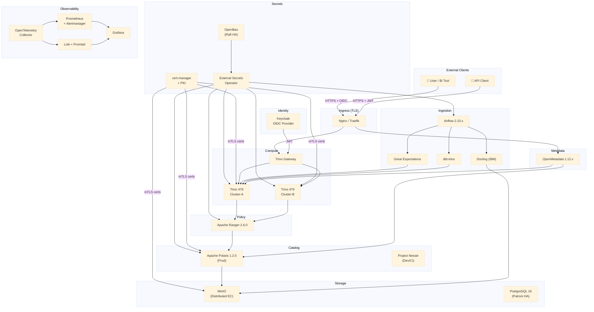

# Open Lakehouse Platform

> **100% open source · Zero hardcoded credentials · mTLS everywhere · GDPR · SOC2 · HIPAA-ready**

A production-grade, enterprise-class open data lakehouse built entirely on Apache 2.0 (and compatible) open source components. Designed for multi-tenant analytics workloads with end-to-end security, compliance, and observability baked in from day one.

---

## Architecture Overview



---

## Component Version Table

| Component | Version | License | Role |
|---|---|---|---|
| Apache Iceberg | 1.10.x | Apache 2.0 | Table format for all data |
| Apache Polaris | 1.2.0 | Apache 2.0 | Production Iceberg REST catalog |
| Project Nessie | latest stable | Apache 2.0 | Dev/CI catalog (Git-like branching) |
| Trino | 479 | Apache 2.0 | MPP SQL query engine |
| Trino Gateway | latest stable | Apache 2.0 | Load balancer + JWT auth endpoint |
| Apache Ranger | 2.6.0 | Apache 2.0 | RBAC, ABAC, row-level security |
| OpenMetadata | 1.12.x | Apache 2.0 | Data catalog, lineage, governance |
| OpenBao | latest stable | Apache 2.0 | Secrets management (BSL-free Vault fork) |
| External Secrets Operator | latest stable | Apache 2.0 | K8s secret sync from OpenBao |
| cert-manager | latest stable | Apache 2.0 | Automated TLS certificate lifecycle |
| Keycloak | latest stable | Apache 2.0 | OIDC identity provider (SSO) |
| Docling (IBM) | latest stable | Apache 2.0 | Document parsing (PDF→Parquet, offline) |
| Apache Airflow | 2.10.x | Apache 2.0 | Pipeline orchestrator |
| dbt-core + dbt-trino | latest stable | Apache 2.0 | SQL transformation models |
| Great Expectations | latest stable | Apache 2.0 | Data quality validation framework |
| MinIO | latest stable | AGPL 3.0 | S3-compatible object storage (distributed) |
| Prometheus + Alertmanager | latest stable | Apache 2.0 | Metrics + alerting |
| Grafana | latest stable | AGPL 3.0 | Observability dashboards |
| OpenTelemetry Collector | latest stable | Apache 2.0 | Trace/metric/log aggregation |
| Grafana Loki + Promtail | latest stable | AGPL 3.0 | Log aggregation |
| PostgreSQL | 16 | PostgreSQL License | Shared relational backend |

---

## Global Constraints

Every component, configuration, and change in this repository must satisfy:

- ✅ **100% open source** — Apache 2.0 preferred; no BSL, no SSPL, no hybrid licenses
- ✅ **Zero hardcoded credentials** — all secrets managed by OpenBao, injected via External Secrets Operator
- ✅ **mTLS between all internal services** — enforced by cert-manager + OpenBao PKI
- ✅ **Every K8s component** must have: health checks, readiness probes, resource limits, HPA
- ✅ **Multi-environment** — local (Docker Compose) | staging (K8s) | prod (K8s + Terraform)
- ✅ **GDPR, SOC2, HIPAA-ready** — immutable, tamper-evident audit trail from day one
- ✅ **No single point of failure** on any critical path

---

## Prerequisites

### Local Development
- Docker ≥ 26 + Docker Compose ≥ 2.24
- 32 GiB RAM recommended for full local stack
- 50 GiB free disk space

### Kubernetes / Production
- Kubernetes ≥ 1.29
- Helm ≥ 3.14
- kubectl ≥ 1.29
- Terraform ≥ 1.7 (for cloud resources)
- 3+ worker nodes (8 CPUs / 32 GiB RAM each) for minimal viable cluster

---

## Quick Start

> ⚠️ **Not yet available.** Infrastructure code is implemented in a subsequent phase. See [PLAN.md](PLAN.md) for the implementation sequence.

```bash
# Coming in Phase 1 (Weeks 3–4 per PLAN.md)
git clone https://github.com/erramaline/open-lakehouse-platform.git
cd open-lakehouse-platform
# cp infra/local/.env.example infra/local/.env
# docker compose -f infra/local/docker-compose.yml up -d
```

---

## Documentation

| Document | Description |
|---|---|
| [PLAN.md](PLAN.md) | Master architecture plan: directory tree, diagrams, all phases, HA, secrets, testing, rollout |
| [docs/architecture/overview.md](docs/architecture/overview.md) | Component map and responsibilities |
| [docs/architecture/data-flow.md](docs/architecture/data-flow.md) | End-to-end data flow: ingestion → quality → transform → query |
| [docs/architecture/security-model.md](docs/architecture/security-model.md) | Six-layer security model: network → transport → identity → authz → secrets → audit |
| [docs/architecture/ha-topology.md](docs/architecture/ha-topology.md) | Per-component HA design with RTO/RPO targets |
| [docs/adr/](docs/adr/) | Architecture Decision Records (10 ADRs) |
| [docs/compliance/gdpr-data-map.md](docs/compliance/gdpr-data-map.md) | GDPR Article 30 data map, subject rights procedures |
| [docs/compliance/soc2-control-mapping.md](docs/compliance/soc2-control-mapping.md) | SOC2 TSC → platform control mapping |
| [docs/compliance/audit-trail-specification.md](docs/compliance/audit-trail-specification.md) | Audit event schema, WORM storage spec, hash chain |

### Architecture Decision Records

| ADR | Title | Status |
|---|---|---|
| [ADR-001](docs/adr/ADR-001-polaris-vs-atlas.md) | Why Apache Polaris over Apache Atlas | Accepted |
| [ADR-002](docs/adr/ADR-002-openbao-vs-vault.md) | Why OpenBao over HashiCorp Vault (BSL analysis) | Accepted |
| [ADR-003](docs/adr/ADR-003-docling-vs-unstructured.md) | Why Docling over Unstructured-IO | Accepted |
| [ADR-004](docs/adr/ADR-004-great-expectations.md) | Why Great Expectations for data quality | Accepted |
| [ADR-005](docs/adr/ADR-005-dual-catalog-strategy.md) | Dual catalog: Polaris (prod) vs Nessie (dev) | Accepted |
| [ADR-006](docs/adr/ADR-006-mtls-strategy.md) | mTLS: cert-manager + OpenBao PKI vs service mesh | Accepted |
| [ADR-007](docs/adr/ADR-007-identity-federation-keycloak.md) | Identity federation — Keycloak OIDC as single IdP | Accepted |
| [ADR-008](docs/adr/ADR-008-ha-strategy.md) | HA strategy per component | Accepted |
| [ADR-009](docs/adr/ADR-009-audit-trail-design.md) | Audit trail: immutability and storage backend | Accepted |
| [ADR-010](docs/adr/ADR-010-multi-tenancy-model.md) | Multi-tenancy: Trino, Ranger, and Polaris isolation | Accepted |

---

## License

All platform configuration, documentation, and code in this repository is distributed under the **Apache License 2.0**, unless a specific file header indicates otherwise.

Component licenses are documented in the version table above. AGPL 3.0 components (MinIO, Grafana, Loki) are used as self-hosted services — they are not distributed or modified, which is the standard interpreted use case for AGPL in self-hosted infrastructure deployments. Consult your legal team if in doubt.
