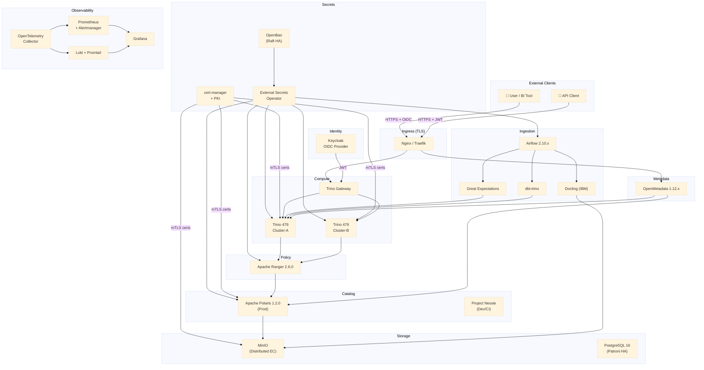

# Open Lakehouse Platform

> **100% open source · Zero hardcoded credentials · mTLS everywhere · GDPR · SOC2 · HIPAA-ready**

A production-grade, enterprise-class open data lakehouse built entirely on Apache 2.0 (and compatible) open source components. Designed for multi-tenant analytics workloads with end-to-end security, compliance, and observability baked in from day one.

---

## Architecture Overview



---

## Component Version Table

| Component | Version | License | Role |
|---|---|---|---|
| Apache Iceberg | 1.10.x | Apache 2.0 | Table format for all data |
| Apache Polaris | 1.2.0 | Apache 2.0 | Production Iceberg REST catalog |
| Project Nessie | latest stable | Apache 2.0 | Dev/CI catalog (Git-like branching) |
| Trino | 479 | Apache 2.0 | MPP SQL query engine |
| Trino Gateway | latest stable | Apache 2.0 | Load balancer + JWT auth endpoint |
| Apache Ranger | 2.6.0 | Apache 2.0 | RBAC, ABAC, row-level security |
| OpenMetadata | 1.12.x | Apache 2.0 | Data catalog, lineage, governance |
| OpenBao | latest stable | Apache 2.0 | Secrets management (BSL-free Vault fork) |
| External Secrets Operator | latest stable | Apache 2.0 | K8s secret sync from OpenBao |
| cert-manager | latest stable | Apache 2.0 | Automated TLS certificate lifecycle |
| Keycloak | latest stable | Apache 2.0 | OIDC identity provider (SSO) |
| Docling (IBM) | latest stable | Apache 2.0 | Document parsing (PDF→Parquet, offline) |
| Apache Airflow | 2.10.x | Apache 2.0 | Pipeline orchestrator |
| dbt-core + dbt-trino | latest stable | Apache 2.0 | SQL transformation models |
| Great Expectations | latest stable | Apache 2.0 | Data quality validation framework |
| MinIO | latest stable | AGPL 3.0 | S3-compatible object storage (distributed) |
| Prometheus + Alertmanager | latest stable | Apache 2.0 | Metrics + alerting |
| Grafana | latest stable | AGPL 3.0 | Observability dashboards |
| OpenTelemetry Collector | latest stable | Apache 2.0 | Trace/metric/log aggregation |
| Grafana Loki + Promtail | latest stable | AGPL 3.0 | Log aggregation |
| PostgreSQL | 16 | PostgreSQL License | Shared relational backend |

---

## Global Constraints

Every component, configuration, and change in this repository must satisfy:

- ✅ **100% open source** — Apache 2.0 preferred; no BSL, no SSPL, no hybrid licenses
- ✅ **Zero hardcoded credentials** — all secrets managed by OpenBao, injected via External Secrets Operator
- ✅ **mTLS between all internal services** — enforced by cert-manager + OpenBao PKI
- ✅ **Every K8s component** must have: health checks, readiness probes, resource limits, HPA
- ✅ **Multi-environment** — local (Docker Compose) | staging (K8s) | prod (K8s + Terraform)
- ✅ **GDPR, SOC2, HIPAA-ready** — immutable, tamper-evident audit trail from day one
- ✅ **No single point of failure** on any critical path

---

## Prerequisites

### Local Development
- Docker ≥ 26 + Docker Compose ≥ 2.24
- 32 GiB RAM recommended for full local stack
- 50 GiB free disk space

### Kubernetes / Production
- Kubernetes ≥ 1.29
- Helm ≥ 3.14
- kubectl ≥ 1.29
- Terraform ≥ 1.7 (for cloud resources)
- 3+ worker nodes (8 CPUs / 32 GiB RAM each) for minimal viable cluster

---

## Quick Start

### Prerequisites

- Docker ≥ 24 and Docker Compose v2
- 16 GB RAM minimum (32 GB recommended for the full stack)
- 50 GB free disk space

### 1. Clone & configure

```bash
git clone https://github.com/your-org/open-lakehouse-platform.git
cd open-lakehouse-platform
cp local/.env.example local/.env   # edit passwords and TLS settings
```

### 2. Start the stack

```bash
make dev-up          # bootstraps all 15 services (~5 minutes first run)
```

This runs the bootstrap scripts in order:
`00-init-tls.sh` → `01-init-openbao.sh` → `02-init-keycloak.sh` → `03-init-minio.sh` → `04-init-polaris.sh` → `05-init-ranger.sh` → `06-init-openmetadata.sh`

### 3. Seed sample data

```bash
make seed            # loads TPC-H sf0.01 into the Iceberg raw layer
```

### 4. Run tests

```bash
make test-unit       # ~30 s — no running services required
make test            # integration + e2e (requires make dev-up)
```

### 5. Access the UIs

| Service | URL | Default credentials |
|---|---|---|
| Trino | <http://localhost:8080> | `admin` / *(none)* |
| MinIO Console | <http://localhost:9001> | `minioadmin` / `minioadmin` |
| Keycloak | <http://localhost:9080> | `admin` / `admin` |
| Airflow | <http://localhost:8888> | `admin` / `admin` |
| Grafana | <http://localhost:3000> | `admin` / `admin` |
| OpenMetadata | <http://localhost:8585> | `admin@open-metadata.org` / `admin` |
| Apache Ranger | <http://localhost:6080> | `admin` / `admin` |
| Nessie | <http://localhost:19120> | *(no auth)* |
| Polaris | <http://localhost:8181> | OAuth2 — see `04-init-polaris.sh` |
| Prometheus | <http://localhost:9090> | *(no auth)* |
| Alertmanager | <http://localhost:9093> | *(no auth)* |

> **Security note:** Default credentials are for local development only.  
> The bootstrap scripts rotate them for non-local environments.

### Make targets reference

| Target | Description |
|---|---|
| `make dev-up` | Start all Docker Compose services and run bootstrap scripts |
| `make dev-down` | Stop all services (preserve volumes) |
| `make seed` | Load TPC-H sf0.01 sample data |
| `make test-unit` | pytest tests/unit/ (no services needed) |
| `make test-integration` | pytest tests/integration/ (requires dev-up) |
| `make test-e2e` | pytest tests/e2e/ (requires dev-up + seed) |
| `make test-performance` | Locust + benchmark suite |
| `make test` | All tests |
| `make lint` | ruff + black + yamllint + shellcheck |
| `make dbt-run` | dbt deps + run staging + marts + tests |
| `make helm-lint` | Lint all Helm charts |
| `make tf-validate` | Validate all Terraform modules |

---

## Documentation

| Document | Description |
|---|---|
| [PLAN.md](PLAN.md) | Master architecture plan: directory tree, diagrams, all phases, HA, secrets, testing, rollout |
| [docs/architecture/overview.md](docs/architecture/overview.md) | Component map and responsibilities |
| [docs/architecture/data-flow.md](docs/architecture/data-flow.md) | End-to-end data flow: ingestion → quality → transform → query |
| [docs/architecture/security-model.md](docs/architecture/security-model.md) | Six-layer security model: network → transport → identity → authz → secrets → audit |
| [docs/architecture/ha-topology.md](docs/architecture/ha-topology.md) | Per-component HA design with RTO/RPO targets |
| [docs/adr/](docs/adr/) | Architecture Decision Records (10 ADRs) |
| [docs/compliance/gdpr-data-map.md](docs/compliance/gdpr-data-map.md) | GDPR Article 30 data map, subject rights procedures |
| [docs/compliance/soc2-control-mapping.md](docs/compliance/soc2-control-mapping.md) | SOC2 TSC → platform control mapping |
| [docs/compliance/audit-trail-specification.md](docs/compliance/audit-trail-specification.md) | Audit event schema, WORM storage spec, hash chain |

### Architecture Decision Records

| ADR | Title | Status |
|---|---|---|
| [ADR-001](docs/adr/ADR-001-polaris-vs-atlas.md) | Why Apache Polaris over Apache Atlas | Accepted |
| [ADR-002](docs/adr/ADR-002-openbao-vs-vault.md) | Why OpenBao over HashiCorp Vault (BSL analysis) | Accepted |
| [ADR-003](docs/adr/ADR-003-docling-vs-unstructured.md) | Why Docling over Unstructured-IO | Accepted |
| [ADR-004](docs/adr/ADR-004-great-expectations.md) | Why Great Expectations for data quality | Accepted |
| [ADR-005](docs/adr/ADR-005-dual-catalog-strategy.md) | Dual catalog: Polaris (prod) vs Nessie (dev) | Accepted |
| [ADR-006](docs/adr/ADR-006-mtls-strategy.md) | mTLS: cert-manager + OpenBao PKI vs service mesh | Accepted |
| [ADR-007](docs/adr/ADR-007-identity-federation-keycloak.md) | Identity federation — Keycloak OIDC as single IdP | Accepted |
| [ADR-008](docs/adr/ADR-008-ha-strategy.md) | HA strategy per component | Accepted |
| [ADR-009](docs/adr/ADR-009-audit-trail-design.md) | Audit trail: immutability and storage backend | Accepted |
| [ADR-010](docs/adr/ADR-010-multi-tenancy-model.md) | Multi-tenancy: Trino, Ranger, and Polaris isolation | Accepted |

---

## Validation Deployment (Oracle Cloud Always Free)

A single-node deployment profile is provided for full-stack connection validation on a free-tier ARM64 VM, without requiring any HA infrastructure.

### Prerequisites

- Oracle Cloud account with an **Always Free** VM shape: `VM.Standard.A1.Flex` — **4 OCPU / 24 GB RAM / ARM64**
- [k3s](https://k3s.io) installed on the VM (`curl -sfL https://get.k3s.io | sh -`)
- Helm 3.14+ installed
- `kubectl` configured against the k3s cluster

### Deployment

```bash
# 1. Deploy the full stack (single-node profile)
make validate-up

# 2. Run all tests
make validate-all

# Optional — run only unit + integration
make validate-test

# Optional — run only e2e (excluding DR)
make validate-e2e

# Optional — run DR tests explicitly
make validate-dr
```

### Expected Results

| Test suite | Expected outcome |
|---|---|
| Unit tests (`tests/unit/`) | 92+ passed, 0 failed |
| Integration tests (`tests/integration/`) | All passed |
| End-to-end tests (`tests/e2e/`, excl. DR) | All passed |

### What is not tested in this mode

| Feature | Reason |
|---|---|
| HA failover (coordinator, OpenBao Raft, Keycloak) | Single-replica deployment — no standby to fail over to |
| HPA autoscaling | `autoscaling.enabled: false` — no metrics-server scaling |
| MinIO erasure coding | `mode: standalone` — single drive, no EC parity |
| PostgreSQL streaming replication | `readReplica.enabled: false` |
| Celery worker autoscaling | `executor: LocalExecutor` — no Redis/Celery |

---

## License

All platform configuration, documentation, and code in this repository is distributed under the **Apache License 2.0**, unless a specific file header indicates otherwise.

Component licenses are documented in the version table above. AGPL 3.0 components (MinIO, Grafana, Loki) are used as self-hosted services — they are not distributed or modified, which is the standard interpreted use case for AGPL in self-hosted infrastructure deployments. Consult your legal team if in doubt.
